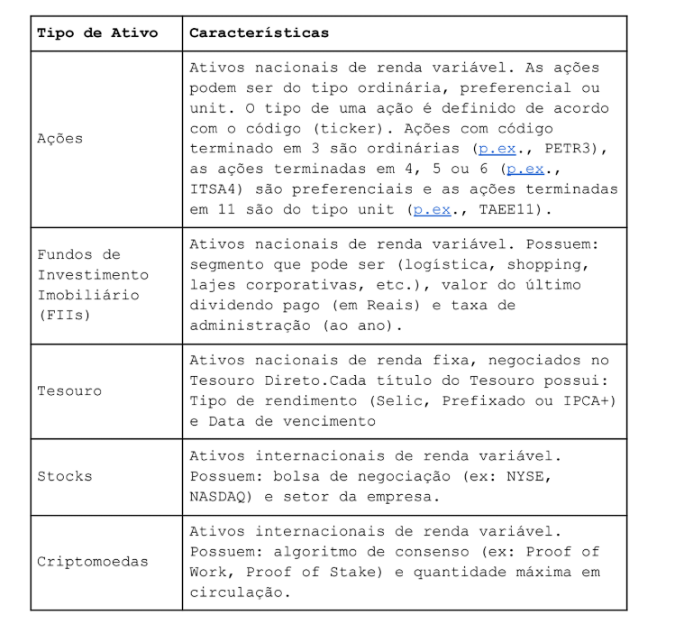

# Plano Incial
Sistema possui Ativos e Investidores com cada um com seu subMenu.
Ativos:  
- Cadastrar Ativos em lote(arq a parte) ou individualmente.
- Editar Ativos.
- Remover Ativos.
- Exibir relatório de Ativos:
- - Todos os Ativos.
-  - Apenas cada um.
- Voltar pro menu.

Investidores:
- Cadastrar Investidores em lote(arq a parte) ou individualmente.
- -Exibir lista de Investidores.
- Excluir Investidores em memória separado por vírgula dada lista de cpf/cnpj.
- Selecionar Investidor por cpf/cnpj.

Menu do investidor selecionado:
- Editar informações do investidor.
- Excluir investidor.
- Exibir valor total gasto (em Real).
- Exibir valor total atual (em Real).
- Exibir as porcentagens de produtos de renda fixa e de renda
  variável.
-  Salvar relatório. Essa opção deve gerar um relatório que
  exiba todas as informações de exibições listadas acima.
  Formatos recomendados JSON ou YAML. Vocês podem definir a
  estrutura desses arquivos, desde que seja coerente.
- Adicionar uma movimentação de compra
- Adicionar uma movimentação de venda
- Adicionar lote de movimentações. O usuário deverá informar
   caminho do arquivo.
- Voltar para o menu anterior

Objeto Ativo:
- Nome
- Código de negociação (ticker)
- Preço atual
- Qualificado (indica se apenas investidores qualificados
podem adquirir aquele ativo)
- Nacionais/Internacionais

Objetos advindos do Ativo:

Regras:
- Todo FII deve obrigatoriamente ter um método para exibir a
taxa de administração concatenada com o sinal de “%”.
- Se não houver indicação de que o ativo é restrito a
investidores qualificados, deve-se considerar que ele pode
ser negociado livremente por qualquer investidor.
- Ativos internacionais devem obrigatoriamente ter um método
para converter a moeda do ativo em reais. Portanto,
precisam ter um atributo que representa o fator de
conversão. Por exemplo, para um ativo em Dólar a o fator de
conversão atualmente (07/01/2025) é 5.39, pois, para
transformar US$1,00 em Real, é preciso multiplicar esse
valor por 5.39 na cotação atual.

Objeto Investidor:
- Nome
- Identificador (CPF ou CNPJ)
- Telefone
- Data de nascimento
- Endereço completo (rua, número, bairro, CEP, cidade,
estado)
- Patrimônio total (em Real).
- Uma carteira de investimentos que:
- - Armazene os ativos que ele possui;
- -  Registre a quantidade de cada ativo (a quantidade pode
ser um número real (p.ex., 5.2);
- - Seja atualizada conforme registro de movimentações de
compra e venda;
- - Permita verificar o valor total da carteira (em Real);
- - Permita verificar a percentagem de produtos de renda
fixa e renda variável;
- - Permita verificar a percentagem de produtos nacionais
e internacionais.

Regras:
- Investidores institucionais podem movimentar qualquer ativo
- Sobre os investidores Pessoa Física:
- - Apenas aqueles com perfil Arrojado, podem movimentar
criptoativos.
- - Apenas aqueles com perfil Moderado ou Arrojado, podem
movimentar stocks
○ Ativos qualificados só podem ser movimentados por
investidores qualificados ou por investidores
institucionais. Os investidores qualificados são
aqueles que têm pelo menos R$1.000.000,00 de
patrimônio total.

- - Todo investidor obrigatoriamente deve possuir a capacidade
de cadastrar investimento. Essa funcionalidade é
responsável por registrar as movimentações causando
alterações na carteira de investimento.
- - Vendas não podem exceder a quantidade disponível. Por
exemplo, se a carteira tem apenas 3.0 ações do Itaú
(ITUB3), a movimentação de venda de 5.0 ações do Itaú
não deve ser executada, mantendo a carteira do
investidor com 3.0 ações do Itaú.

- Ao executar o método de investir o sistema deverá informar
se a movimentação foi bem sucedida ou não.

Movimentação:
- Um identificador único da movimentação
- Um indicador do tipo de negociação, sendo esse de compra ou
de venda. Uma compra indica que ativos serão adicionados à
carteira e uma venda indica que ativos serão removidos da
carteira.
- Em que instituição foi executada a movimentação. Por
exemplo, NuInvest, Clear Corretora, Corretora Rico, etc.
- O ativo negociado (p.ex., Ação da Cemig - CMIG4). O código
do ativo deve ser utilizado para buscar o ativo. Se o ativo
não existir na base de dados a movimentação não pode ser
realizada.
- A quantidade de ativos negociados (p.ex. 5.3)
- Data de negociação
- Preço de execução

Regras Gerais:
- Distribua o código em pacotes que unifiquem classes que
tenham uma relação semântica forte.
- Aplique o encapsulamento de forma correta. Ou seja, não
permita que outras classes acessem os atributos diretamente
e permita que toda comunicação vinda de outras classes seja
a partir de métodos seguros.
- A implementação deve utilizar herança, abstração e
interfaces.
- O código deve ter tratamento completo de exceções. Inclua
ao menos uma exceção personalizada. Ou seja, crie e utilize
ao menos uma classe própria para tratamento de exceções. De
forma geral, sempre que possível, utilize classes de
exceção nativas do Java. Obs.: Evite utilizar classes
genéricas como Exception e RuntimeException.
- Evite a todo custo duplicação de código (Herança e
Interface podem auxiliar nisso). Mas, além de aplicar os
conceitos de OO de forma coerente, crie funções para para
encapsular trechos de código que são utilizados em
múltiplas partes do código.
- Inclua atributos, métodos e tratamentos de exceção que
auxiliem no desenvolvimento da solução mesmo que eles não
tenham sido diretamente mencionados nos requisitos do
trabalho. Por exemplo, mesmo que no texto acima não tenha
sido mencionado, será que faz sentido ter um investidor sem
nome ou sem CPF (ou CNPJ)? A resposta é não, então faça os
tratamentos necessários.
- Crie os arquivos necessários para testar as funcionalidades
de inserção em lote. Por exemplo, crie um arquivo CSV com
informações de vários investidores e teste a opção de
carregar investidores em lote. Faça o mesmo com relação aos
ativos e movimentações.